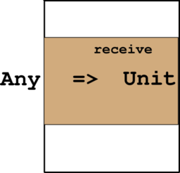
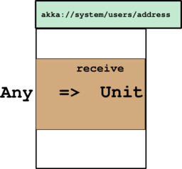
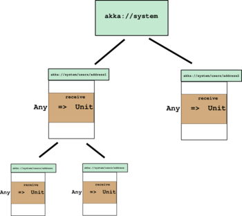

An Introduction to Akka
======================
:author: Mikołaj Koziarkiewicz
:backend: slidy
:duration: 35
:data-uri:
:icons:

== Akka - what is it? 1/2

 - a platform,
 - "for building highly concurrent, distributed, and resilient message-driven applications on the JVM."<<1>>,
 - based on *the actor model*.
 
// remember the traits:
// - concurrent
// - distributed
// - resilient
 
== Akka - what is it? 2/2

* platform has a lot of specialized extensions
* all based on the `actor` core
* goal of the presentation:
** explain the core

// metric f-ton of extensions
// about 20...
// only focusing on core, with bits on
// because once grok core, can learn others

 
== Actor model - what is it?

* actor: unit of computation
* actors build actor systems
* quite "old" (1973).<<2>>

== Anatomy of an Akka Actor - intro 1/2

[source,scala]
----
class MyActor extends Actor {
    def receive = {
       case Something => //...
    }
}
----

//box for computation
//computation is function Any => Unit
//yes, API not typed
//become?
//HAS a reference

== Anatomy of an Akka Actor - intro 2/2

//actor has address - `ActorRef`
//address is URL like
//address is only access point
//no access to innards

== My first Akka Actor™

[source,scala]
----
class HaiActor extends Actor {
  def receive: Receive = {
    case target: ActorRef => target ! "Hello!"
    case "Hello!" => sender ! "OHAI"
    case "OHAI" => println(s"$self: got OHAI from $sender")
  }
}
----

Where:
[source,scala]
----
type Receive = PartialFunction[Any, Unit]
----

//so, subclass Actor
//implement receive
//! is alias for send
//sender is "magic" reference
//same as (Any) => Unit, but returns MatchError
//if value for arg not defined

== My first Akka Actor™ - example

== Anatomy of an Akka Actor - hierarchy

//addresses in hierarchies
//allow coord

== Akka actor model - lifecycle & hierarchy

Purpose: 

* division of labor
* supervision:
** each actor has lifecycle
*** special hooks - `preStart`, `preRestart`, `postStop`
*** allow for e.g. self-init
** "parent" controls how it reacts to failure

//actors in hierarchy
//"parent" supervises children
//many supervising strategies
//hierarchy also used for organizing work
//so don't get wrong impression

== Hierarchy - example 

== Akka - guarantees

 - an actor processes one message at a time,
 - a message will be delivered at most 1 times,
 - messages are ordered by sender
 
//normally actor obtains a thread for N messages waiting in mailbox
//because of network issues etc.
//locally better effort (since testkit relies on that)

== Guarantee takeaways

* don't pass mutable state,
* use services to ensure send:
** `contex.scheduler`
** persistence

//only way you can shoot yrself in the foot,
//services are:
//scheduler
//persistence

== Testing

* Akka Testkit
* Features:
** can run special 1-thread dispatcher
** asserts for getting msgs
** `TestProbe`

//1 thread important because gives consistency

== Remoting 

* Simple remoting:
** e.g. `"akka.tcp://remote@freund.de:1337/user/actorName"`
** remote creation as well

== Talking to actor system

* Custom:
** ask pattern
[source,scala]
----
ask(actoRef, request)(timeout): Future
----
** Many others (also builtin)

// ask-pattern - generic, untyped
// many builtins, also Scalatra

== Summary

* Akka - actor model on the JVM
* alternative way to handle
** concurrency
** distribution
* declared guarantees
** make reasoning easier

//less chance to cause bugs

== The End

=== THANK YOU!

==== Doc link:

http://doc.akka.io/docs/akka/current/scala.html

==== Bibliography
[bibliography]
- [[1]] http://akka.io , retrieved 2015-04-20
- [[2]] https://en.wikipedia.org/wiki/History_of_the_Actor_model , retrieved 2015-04-12